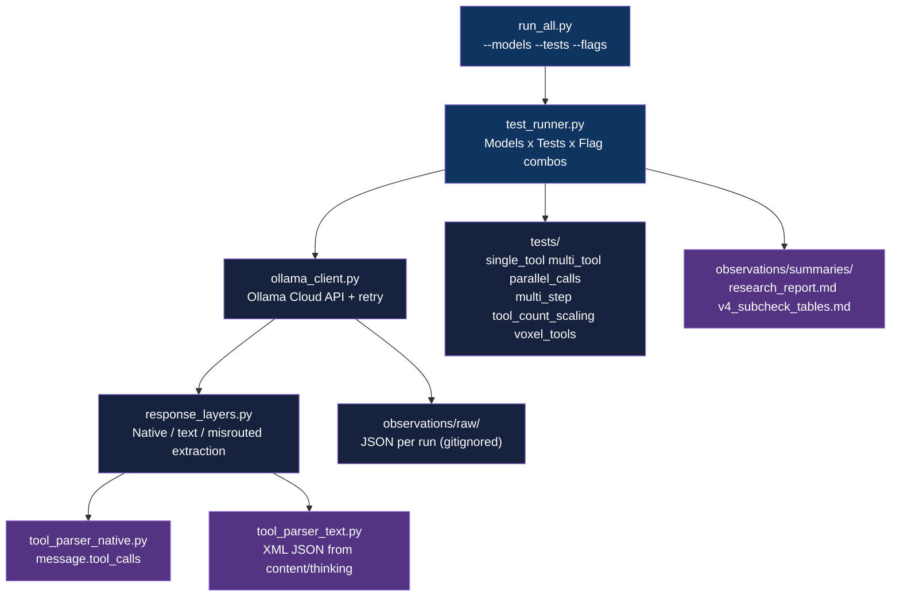

<div align="center">

# Ollama Tool Calling Research

[](https://www.python.org/downloads/)
[](LICENSE)

**Benchmark tool calling behavior across 32 open-source LLMs via the Ollama Cloud API across 1,792 controlled runs**

[Getting Started](#getting-started) | [Usage](#usage) | [Methodology](#methodology) | [Results](#results)

</div>

---

## Table of Contents

- [The Problem](#the-problem)
- [Features](#features)
- [Tech Stack](#tech-stack)
- [Architecture](#architecture)
- [Getting Started](#getting-started)
  - [Prerequisites](#prerequisites)
  - [Installation](#installation)
  - [Configuration](#configuration)
- [Usage](#usage)
- [How It Works](#how-it-works)
- [Methodology](#methodology)
- [Results](#results)
- [Architectural Decisions](#architectural-decisions)
- [Project Structure](#project-structure)
- [Testing](#testing)
- [Related Projects](#related-projects)
- [License](#license)
- [Author](#author)

## The Problem

### Tool calling reliability is opaque across open-source LLMs

Open-source LLMs advertise "tool calling support" without disclosing how that support degrades under streaming, extended conversations, large tool sets, or strict schema constraints. No public dataset existed that held `temperature=0` + `seed=42` constant across a full flag matrix (`stream` x `think`) for the same models at the same point in time.

### The Solution

Systematic benchmark of 32 models via the Ollama Cloud API across 7 tests, 4 flag combinations, and two independent sweeps (v3 + v4), producing 60 scored checks per model. Results expose which families are flag-agnostic and production-safe, and which collapse under the voxel schema stress test, the real discriminator.

## Features

- **7-test suite across 3 tiers**: core invocation, multi-step stress, and voxel schema constraint tests with 5 sub-checks each
- **4-flag matrix per test**: all combinations of `stream` and `think` flags (S0T0/S0T1/S1T0/S1T1), 60 scored checks per model
- **Dual-layer extraction**: native `tool_calls` and XML text-fallback parsed from both `content` and `thinking` fields
- **Reproducible runs**: `temperature=0`, `seed=42` across all runs; retry with exponential backoff on transient 500/503 errors
- **Group-based model registry**: 32 models classified GA-GD by pass pattern; addressable as `ga`/`gb`/`gc`/`gd`/`all` from the CLI
- **Auto-saved summaries**: per-run markdown tables written to `observations/summaries/` with timestamps

## Tech Stack

| Component | Technology |
|-----------|------------|
| Language | Python 3.12+ |
| LLM Runtime | Ollama Cloud API (Ollama SDK) |
| CLI output | Rich |
| Config | python-dotenv, Pydantic |
| Models tested | ministral-3, kimi-k2.5, gemini-3-flash-preview, devstral-2, deepseek-v3, qwen3, glm, gemma3 (32 total) |

## Architecture



## Getting Started

### Prerequisites

- Python 3.12+
- Ollama Cloud API key (from [ollama.com](https://ollama.com))

### Installation

1. Clone the repository:
   ```bash
   git clone https://github.com/adityonugrohoid/ollama-tool-calling-research.git
   cd ollama-tool-calling-research
   ```

2. Create and activate a virtual environment:
   ```bash
   python -m venv .venv
   source .venv/bin/activate
   ```

3. Install dependencies:
   ```bash
   pip install -r requirements.txt
   ```

### Configuration

```bash
cp .env.example .env
```

Edit `.env` with your settings:

<details>
<summary>Full configuration reference</summary>

```bash
# -- Required -------------------------------------------
OLLAMA_HOST=https://ollama.com
OLLAMA_API_KEY=your-api-key-here
```

</details>

## Usage

```bash
# Run all 7 tests against GA models (all 4 flag combos)
python run_all.py

# Run specific model group
python run_all.py --models gb

# Run all 32 models
python run_all.py --models all

# Run baseline only against one model
python run_all.py --models ministral-3:8b --flags S0T0

# Run all 4 flag combos against one model
python run_all.py --models ministral-3:8b

# Run specific tests against specific models
python run_all.py --models kimi-k2.5,ministral-3:3b --tests single_tool,voxel_tools
```

Results are printed as Rich tables and saved to `observations/summaries/<timestamp>_results.md`.

## How It Works

### 1. Triple-loop execution

`test_runner.py` iterates over the Cartesian product of models x tests x flag combos. Each iteration calls the appropriate test function with a `FlagCombo(stream, think, label)` and records a `TestResult` dataclass. Model availability is checked before each model run; unavailable models are skipped and recorded as SKIP rather than FAIL.

### 2. Dual-layer response extraction

`response_layers.py` extracts tool calls from all three response fields in priority order: `message.tool_calls` (native) -> `message.content` (text XML/JSON) -> `message.thinking` (misrouted). Classification is set to `native`, `text`, `misrouted`, or `none`. This design allows the same test logic to score both native and text-based tool calling independently.

### 3. Voxel schema sub-checks

The `voxel_tools` and `voxel_tools_text` tests each expand into 5 sub-checks: coordinate bounds compliance, enum constraint for block type, parallel call correctness, turn-level format stability, and `done` tool termination. Each sub-check is scored P/F/T (pass/fail/timeout) independently, giving 10 total sub-check columns per flag combo and making voxel the highest-resolution discriminator in the suite.

## Methodology

### Test suite (7 tests, 3 tiers)

| Tier | Test | Tools | What it surfaces |
|------|------|-------|------------------|
| Core | single_tool | 1 | Cannot invoke any tool |
| Core | multi_tool | 3 | Cannot select from a set |
| Core | parallel_calls | 3 | Cannot return multiple calls |
| Stress | multi_step | 1 x 5 turns | Format instability over time |
| Stress | tool_count_scaling | 1-15 | Breaks under tool proliferation |
| Schema | voxel_tools | 4 (native) | Schema constraint violations (5 sub-checks) |
| Schema | voxel_tools_text | 4 (text) | Text fallback schema violations (5 sub-checks) |

### Flag matrix (4 combinations per test)

```
                 think=false          think=true
stream=false     S0T0 (baseline)      S0T1 (thinking interference)
stream=true      S1T0 (streaming)     S1T1 (combined stress)
```

7 tests x 4 combos = 28 runs per model. Voxel tests expand to 5 sub-checks each, producing 60 total checks per model. All runs use `temperature=0`, `seed=42`.

### Model groups (behavior-based)

| Group | Pattern | Count | Description |
|-------|---------|-------|-------------|
| GA | All P (60/60) | 10 | Native 40/40, text 20/20 |
| GB | Native P, text varies | 8 | Native perfect, text has confirmed F |
| GC | Text P, native varies | 8 | Text perfect, native has confirmed F |
| GD | Both have F | 6 | Both layers have confirmed failures |

## Results

### Top model families by stable performance

Ranked by: all members score 55+/60, rock-stable across sweeps, flag-agnostic.

| Rank | Family | Models | v4 Score | Badges |
|------|--------|--------|----------|--------|
| 1 | Ministral | 3:3b, 3:8b, 3:14b | 60/60 (all 3) | `PERFECT` `DUAL-LAYER` `ROCK-STABLE` `DETERMINISTIC` `FLAG-AGNOSTIC` |
| 2 | Kimi | k2.5, k2-thinking, k2:1t | 60/60 (all 3) | `PERFECT` `DUAL-LAYER` `DETERMINISTIC` `FLAG-AGNOSTIC` |
| 3 | Gemini | 3-flash-preview | 60/60 | `PERFECT` `DUAL-LAYER` `ROCK-STABLE` `DETERMINISTIC` `FLAG-AGNOSTIC` |
| 4 | Devstral | 2:123b, small-2:24b | 60, 56 | `ROCK-STABLE` `DETERMINISTIC` `FLAG-AGNOSTIC` |
| 5 | Qwen VL | vl:235b, vl:235b-instruct | 60, 57 | `ROCK-STABLE` (instruct) |

**Why Ministral ranks #1:** All three sizes (3B, 8B, 14B) achieve identical perfect scores: every sub-check is `PPPP` across both sweeps, bit-for-bit deterministic. The 3B model matches 1T-parameter models, which is the strongest evidence against a size-quality correlation in this dataset.

### Findings

1. **No size-quality correlation**: ministral-3:3b (3B) = 60/60, deepseek-v3.2 (671B) = 16/60
2. **Streaming degrades, never improves**: `stream=true` adds failure risk without recovering any failing model
3. **Thinking is a wild card**: `think=true` can help or hurt (deepseek-v3.1 alternation observed)
4. **Layer independence**: native and text-based tool calling are orthogonal capabilities
5. **Flag agnosticism = reliability**: all 10 perfect models are completely flag-agnostic
6. **Voxel tests are the real discriminator**: 25/32 pass simple tests, only 10/32 pass all voxel sub-checks
7. **Measurement reproducibility is high**: 14/32 models are fully deterministic at sub-check level across sweeps

### Score distribution

| Tier | Range | Models | % |
|------|-------|--------|---|
| `PERFECT` | 60/60 | 10 | 31% |
| `NEAR-PERFECT` | 55-59 | 6 | 19% |
| `FUNCTIONAL` | 40-54 | 11 | 34% |
| `MINIMAL` | <40 | 5 | 16% |

Full report: [`observations/summaries/research_report.md`](observations/summaries/research_report.md)

### Badge legend

| Category | Badges |
|----------|--------|
| Performance | `PERFECT` 60/60 - `NEAR-PERFECT` 55-59 - `FUNCTIONAL` 40-54 - `MINIMAL` <40 |
| Layer | `DUAL-LAYER` both pass - `NATIVE-ONLY` - `TEXT-ONLY` - `MIXED-LAYER` |
| Stability | `ROCK-STABLE` delta=0 - `DETERMINISTIC` identical sub-checks across sweeps |
| Flags | `FLAG-AGNOSTIC` no stream/think effect - `STREAM-SENSITIVE` - `THINK-ALTERNATING` |
| Failure | `ENUM-HALLUCINATOR` - `BOUNDARY-CONFUSED` - `PARALLEL-INCAPABLE` - `SERVER-BLOCKED` |

## Architectural Decisions

### 1. Dual-layer extraction over test-level branching

**Decision:** `response_layers.py` handles all response parsing centrally, classifying each response as `native`, `text`, `misrouted`, or `none` before returning a unified `ResponseLayers` object.

**Reasoning:** Early versions had each test function call `parse_native()` then `parse_text()` in a hand-rolled cascade. Centralizing into `extract_layers()` removed 50+ lines of duplicated logic and made the `misrouted` case (tool calls emitted into the `thinking` field) detectable consistently across all 7 tests without touching test files.

### 2. Flag matrix as first-class parameter

**Decision:** `FlagCombo(stream, think, label)` is passed to every test function rather than running each test once with hardcoded defaults.

**Reasoning:** Early sweeps missed a class of streaming-only failures because streaming was toggled at the suite level. Encoding flags as a parameter to each `TestFunction` makes it structurally impossible to run a test without specifying the exact flag state, and enables the triple-loop in `test_runner.py` to enumerate all 28 runs per model automatically.

### 3. Text-based tool calling as a first-class layer

**Decision:** `tool_parser_text.py` parses XML `<tool_call>` blocks from `message.content`, and voxel_tools_text runs the full voxel suite against this layer independently.

**Reasoning:** Several strong models (Gemma3 family) have zero native tool support but clean text-fallback behavior. Treating text-based calling as a separate 20/40-check layer rather than a fallback-only path surfaces the GC group (text-perfect, native-imperfect) as a real category, not an artifact.

## Project Structure

```
ollama-tool-calling-research/
├── run_all.py                      # Entry point with --models, --tests, --flags
├── src/
│   ├── ollama_client.py            # Ollama SDK wrapper, retry logic, raw logging
│   ├── response_layers.py          # Layer-aware extraction (native/text/thinking)
│   ├── stream_collector.py         # Streaming chunk collector
│   ├── tool_parser_native.py       # Parse native tool_calls
│   ├── tool_parser_text.py         # Parse text-based tool calls (XML/JSON)
│   └── test_runner.py              # Test orchestrator (model x test x flag loop)
├── tests/
│   ├── config.py                   # Model groups (GA-GD), tool defs, flag combos
│   ├── test_single_tool.py         # Basic tool invocation
│   ├── test_multi_tool.py          # Tool selection from set
│   ├── test_parallel_calls.py      # Parallel tool calls
│   ├── test_multi_step.py          # 5-turn format consistency
│   ├── test_tool_count_scaling.py  # 1-15 tool scaling
│   ├── test_voxel_tools.py         # Complex native schemas (5 sub-checks)
│   └── test_voxel_tools_text.py    # Complex text fallback (5 sub-checks)
├── scripts/
│   └── generate_subcheck_tables.py # Parse sweep results into sub-check tables
├── observations/
│   ├── raw/                        # Raw JSON responses (gitignored)
│   └── summaries/                  # Research deliverables (tracked)
│       ├── research_report.md      # Full research report
│       ├── v4_subcheck_tables.md   # v4 per-sub-check P/F/T data
│       ├── v3_subcheck_tables.md   # v3 per-sub-check P/F/T data
│       └── g{a,b,c,d}_v4_flagmatrix.md  # v4 sweep results per group
├── requirements.txt
└── .env.example
```

## Testing

The `tests/` directory is the research test suite itself: each file implements one tool calling scenario and runs against any model + flag combo combination. Run directly via `run_all.py` (not pytest), since test functions receive the `FlagCombo` parameter and interact with the live Ollama API.

```bash
# Run the full suite against GA models (all flag combos)
python run_all.py

# Run a single test against one model to validate setup
python run_all.py --models ministral-3:8b --tests single_tool --flags S0T0
```

## Related Projects

| Project | Description |
|---------|-------------|
| [ollama-catalog](https://github.com/adityonugrohoid/ollama-catalog) | Ollama model catalog merging cloud API, OCI registry, and local instance into one filterable browser |
| [nim-explorer](https://github.com/adityonugrohoid/nim-explorer) | NVIDIA NIM model catalog and capability probe with tool, JSON, and thinking support per model |
| [vllm-explorer](https://github.com/adityonugrohoid/vllm-explorer) | vLLM server API probe and benchmark with 22-endpoint reference plus TTFT and throughput measurements |
| [llm-voxel-arena](https://github.com/adityonugrohoid/llm-voxel-arena) | Interactive arena where open-source LLMs compete by building voxel structures via tool calling in a ReAct loop |
| [voxel-architect](https://github.com/adityonugrohoid/voxel-architect) | Agentic voxel builder with a 5-tool grid API, 128x128x128 sparse world, and layer-aware response parsing |
| [spatial-llm](https://github.com/adityonugrohoid/spatial-llm) | QLoRA fine-tuning of a 1.2B model on 7x7 grid spatial-design tasks, beating 1T+ baselines via memorization training |
| [open-layer](https://github.com/adityonugrohoid/open-layer) | Open spec for LLM inference I/O with NIM, DeepSeek, and Groq adapters plus a conformance test suite |

## License

This project is licensed under the [MIT License](LICENSE).

## Author

**Adityo Nugroho** ([@adityonugrohoid](https://github.com/adityonugrohoid))
